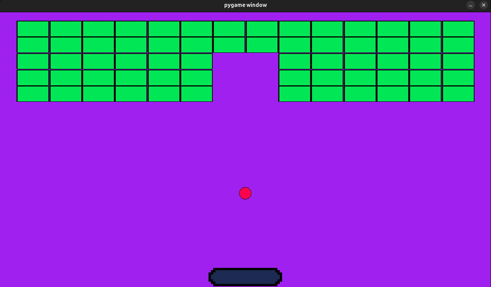

## Brick Breaker (Pygame)
*A simple Brick Breaker clone with only one level.*



## How to Play
1. Install Pygame:  
   ```bash
   pip install pygame
   ```
2. Clone this repository:  
   ```bash
   git clone https://github.com/Pietruszko/py_game_sideproject.git
   ```
3. Run the game:  
   ```bash
   python game.py
   ```
## Controls
- **AD**: Move the paddle  

## Features
- Ball physics and collisions  
- Brick destruction  
- Level generation  

## Possible Improvements
- Power-ups (e.g., bigger paddle, multi-ball) 
- Better physics
- Random level generation
- Scoreboard 
- Sound effects  
- Menus (start screen, pause button)  
- Prettier sprites and effects

## Credits
Made by [Pietruszko](https://github.com/Pietruszko) as a Pygame and Python learning project.
